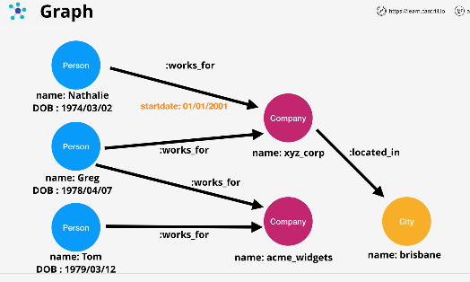
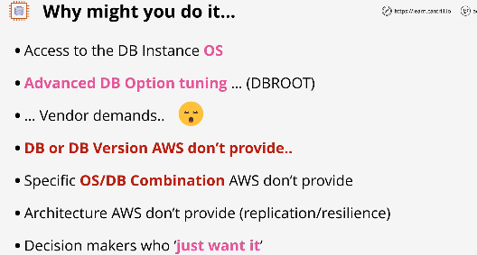
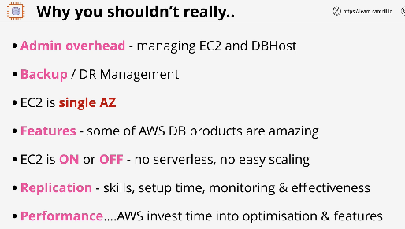
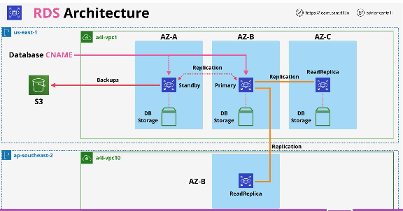

## Database Refresher - part 1

#

- DBs store and manage data
- there are diff types of systems
- relational (SQL) vs non-relational(NoSQL)

- relational dbs: (RDBMS)
  - structured. uses Schema
  - relationship between tables
- NoSQl:

  - not one single thing. everything that isnt RDBMS
  - much more relaxed
  - relationships are handled diff

- relational ex
  - 

## Database Refresher - part 2

#

- types of NoSQL dbs:
  1. key value - what I think it is. Scalable. used for in memory caching
  2. wide column store - variation of key/value. ex: dynamoDB
  - 
  3. document - store/query data as documents. JSON or XML. order db, collections, deep attributes
  - 
  4. column databases - diff than row dbs(sql). solve limitations of row dbs. row dbs - (OLTPS). column dbs store data in columns. good for reporting. aws ex is Redshift
  - 
  5. graphs - think graphQL. uses nodes and edges. relationships are also stored in db. makes them fast
  - 

## Databases on EC2

#

- pros and cons of running DBMS systems directly on EC2

  - one approach is to have everything in one ec2(monolithic?)
  - another is to have architecture split amongst multiple AZs

    - cost considerations, connection considerations

      

  - why you might run a db on ec2:

    - access to db instance OS
    - advanced db option tuning
    - using a DB aws doesnt support

      

  - why you shouldnt:

    - admin overhead
    - backups and disaster recovery mgmt
    - EC2 runs on a single AZ. if that zone fails, db could fail
    - features. AWS db products have amazing features
    - EC2 is on/off - no serverless or easy scaling
    - replication
    - performance

      

    - next 2 lessons dedicated to demos. Migrating the wordpress db monolithic to a dedicated EC2 db

## Relational Database Services (RDS) Architecture

#

- lesson covers high level architecture of the product and details what engines are supported, access methods, and other key concepts
- described as database-as-a-service(DBaaS)
- provides managed database instance (can hold 1+ databases)
  - think of it acting as a ec2 db server
- multiple engines:
  1. mysql
  2. mariadb
     3.postgres
     4.oracle
  3. MS sqlserver
- supports Amazon Aurora - will be it's own lesson in the future

  - 

- RDS instance
  - access it using a CNAME
  - can use existing tooling to access db
  - comes in diff sizes similar to ec2 instances
  - can be single AZ or multi AZ
  - you provision instance
    - comes w/block storage in same AZ
    - can fail because all in one AZ
- billing
  - billed for instance
  - also billed for storage
- security handled via security group

  - 

- next two lessons are demos
  1. migrating a mariadb into RDS part 1
  2. migrating a mariadb into RDS part 2

## RDS High-Availability (Multi AZ)

#

## RDS Automatic Backup, RDS Snapshots and Restore

#

## RDS Read-Replicas

#

## Aurora Architecture

#

## Aurora Global Database

#

## Mulit-master writes

#

## Database Migration Service (DMS)

#
