## 1. Architecture Evolution - Part 1 - Monolithic and Tiered

#

### summary

- 2 part lesson, first part covers how applications can be evolved from monolithic to tiered architecture

### concepts

- monolithic architecture
  - one box handles everything. see cattube example
  - cons: one failure to part affects everything. fail together. also scale together since on same server, and bill together
  - 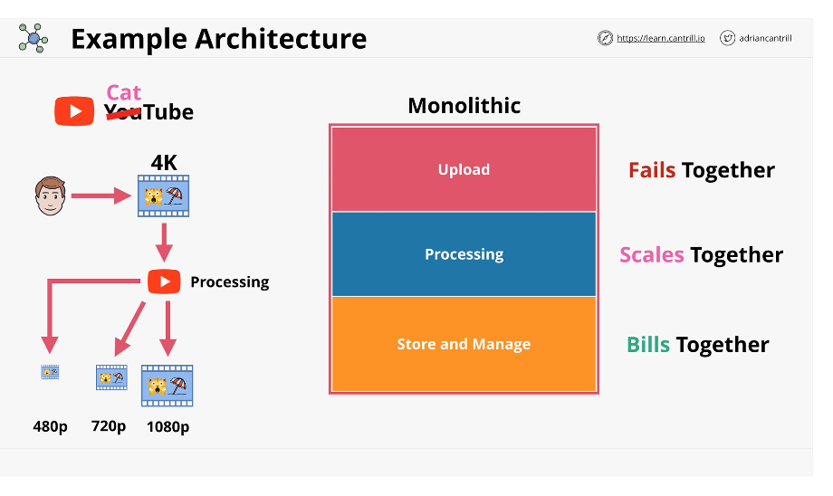
- tiered architecture
  - things are still connected together, but can scale independently
  - can use internal load balancers to manage each tier's load
  - allows for horizontal scaling and HA
  - cons: each tier is still dependent on each other so can't scale to zero and could still fail
  - 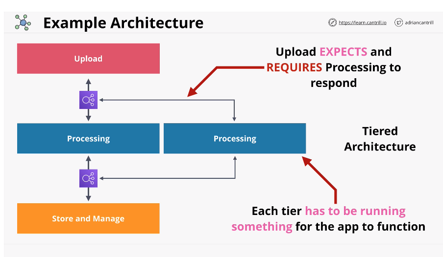

## 2. Architecture Evolution - Part 2 - Queue Based, Microservice & Event Driven

#

### summary

- part 2 looks at the evolution of architecture - queue based design, microservices, event driven architecture

### concepts

- queue

  - similar to CS. FIFO
  - uses async communications, doesn't depend on another tier. decoupled. think cattube s3 bucket from slide
  - 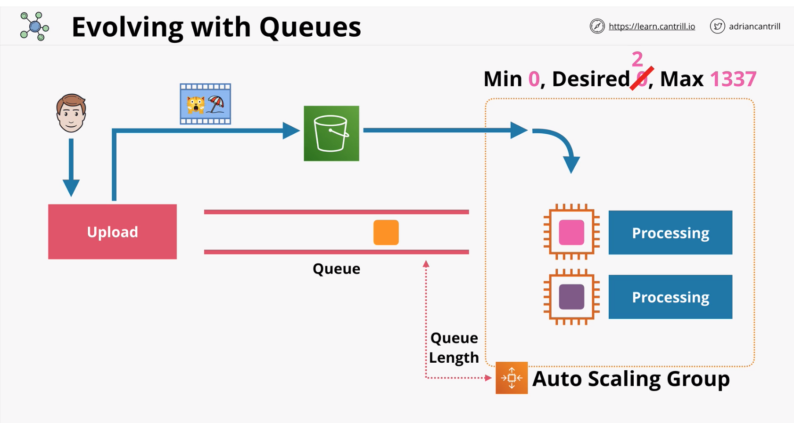

- microservice and event driven architecture
  - do individual things well
  - a microservice is just a tiny self sufficient application
  - producers are triggered by events, consumers take from producers
  - events are generated when something happens
  - event routers handle events between producers/consumers via event bus
  - event driven architures only consume resources when required
  - 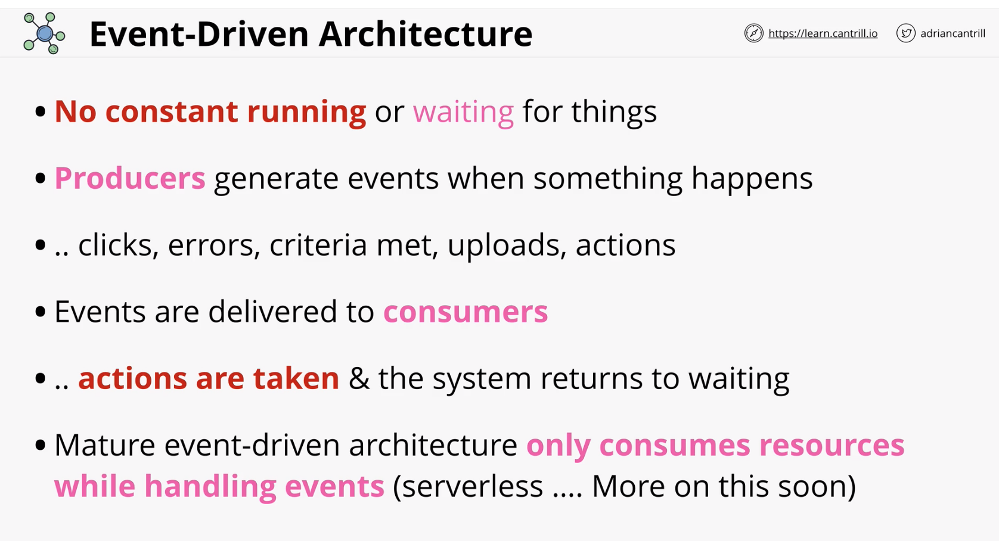

### architecture

- slides
  - 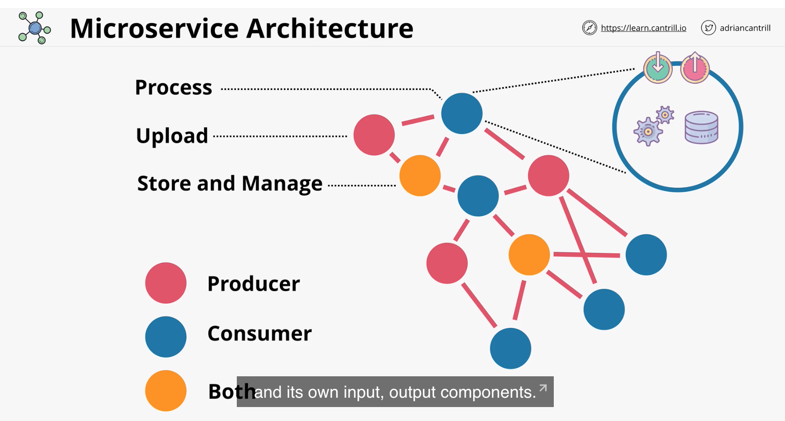
  - 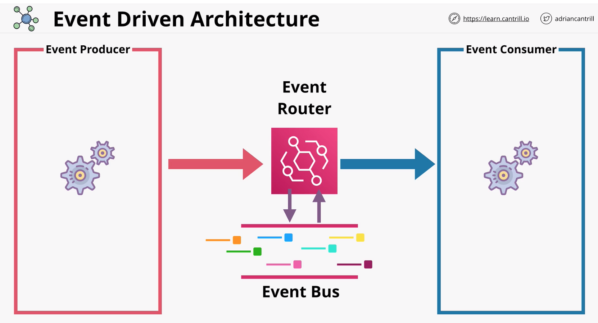

## 3. AWS Lambda

#

### summary

- AWS Lambda is a FaaS(function as a service) provides ability to execute small lambda functions and pay for only the execution duration
- can be invoked manually scheduled in an event-driven way

### concepts

- is a FaaS product
- can be event driven invocation(execution)
- is a piece of code in one language
- Lambda functions use a runtime(eg Python 3.6)
- runs inside of a runtime environment
- you are only billed for the duration the function runs for
- key component of serverless architecture
- 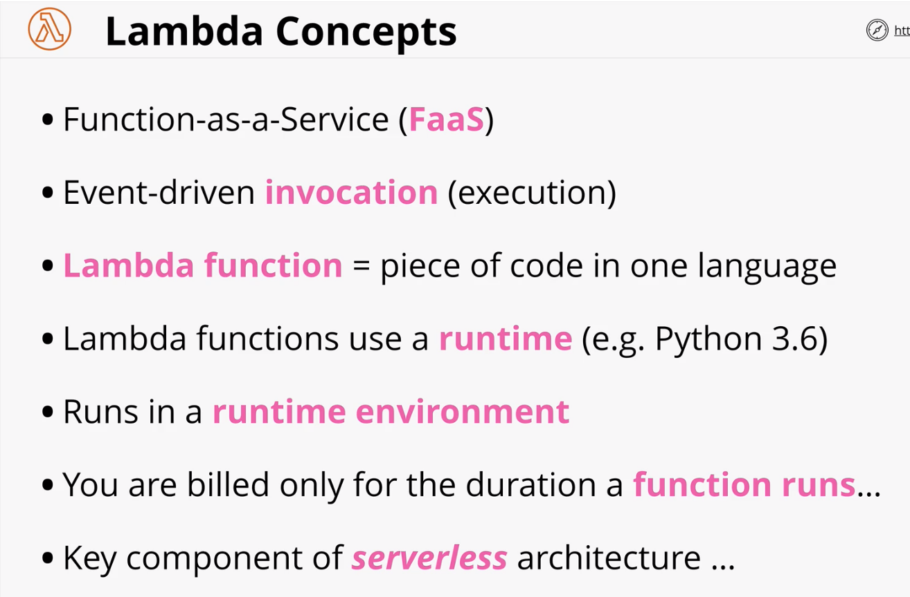

### architecture

- when creating a Lambda function you create a container sortaof
- it's a piece of code that does something
- s/b super specialized
- various languages
- runs in a runtime environment
- you allocate memory/cpu more you allocate more expensive
- can be configured to use IAM role known as execution role
- can be invoked manually or event-driven
- when it's invoked, it's downloaded on to AWS hardware
- the environment it runs in is new and clean (stateless). do not store anything in it
- are public services, have access to internet
- can be configured to run inside a VPC, but will only have internet access if the VPC is configured for internet access
- since Lambda functions are stateless, they get data from internet or AWS resources. needs to have appropriate permissions from execution role to input/output to those resources
- Lambda functions have a 15 minute execution limit
- cheaper than running EC2, especially for things which don't need to run all the time.
- 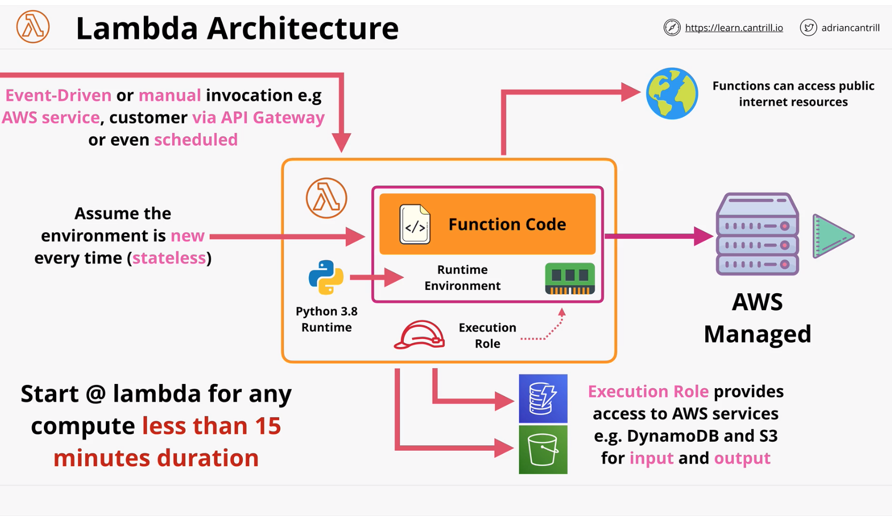

### Key considerations

- currently 15 minute execution limit
- new runtime env every execution no data persistence
- execution roles provides permissions
- load data to/from other services (eg S3, DynamoDB)
- free tier
  - 1M free requests and 400,000 GB-seconds of compute time per month
- 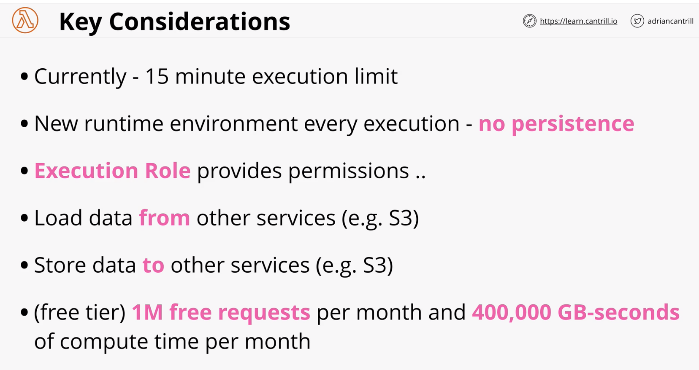

## 4. CloudWatchEvents and EventBridge

#

### summary

- are services that monitor and have visibility over events generated by supported AWS services within an account
- can monitor the default account event bus and pattern match events flowing through and deliver these events to multiple targets
- are also the source of scheduled events which can perform certain actions at certain times of day using CRON time expression format
- both services are how event-driven architectures can be implemented within AWS

### concepts

- Eventbridge is replacing Cloudwatch events. is basically cloudwatch events v2
- logic is "If X happens, or at Y time, do Z"
- both have a default event bus for the account
  - in cloudwatch events, only 1 bus and it's implied
  - in eventbridge, can have multiple buses
- create rules that match incoming events or schedules
- routes events to 1/more targets (eg Lambda)
- 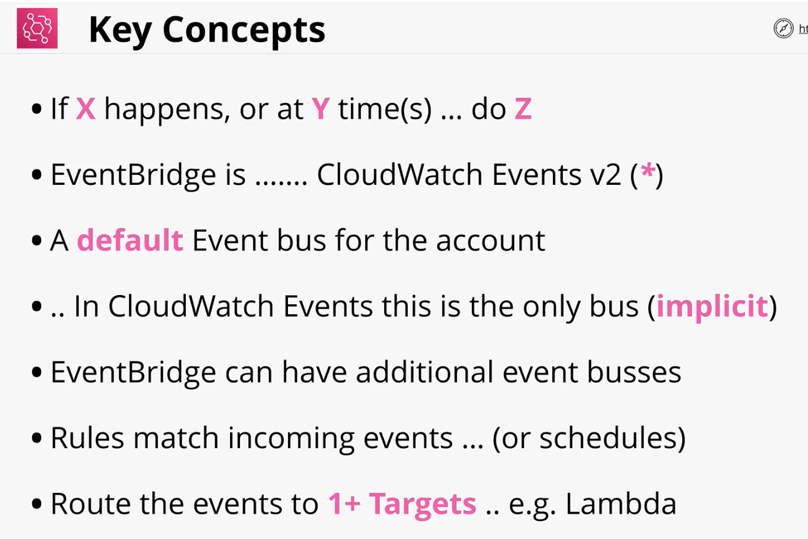

### architecture

- at the heart is event bus - stream of events generated by supported AWS services
- eventbridge monitors events and you create rules
  - 2 types of rules, pattern matching and scheduled
- delivers events to targets
- events themselves are JSON objects
- 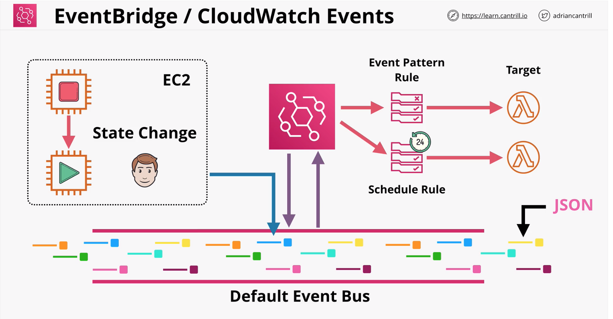

## 5. API Gateway

#

### summary

-

### concepts

-

### architecture

-

## 6. Serverless Architecture

#

### summary

-

### concepts

-

### architecture

-

## 7. Simple Notification Service

#

### summary

-

### concepts

-

### architecture

-

## 8. Step Functions

#

### summary

-

### concepts

-

### architecture

-

## 9. Simple Queue Service

#

### summary

-

### concepts

-

### architecture

-

## 10. Kinesis & Kinesis Firehouse

#

### summary

-

### concepts

-

### architecture

-
