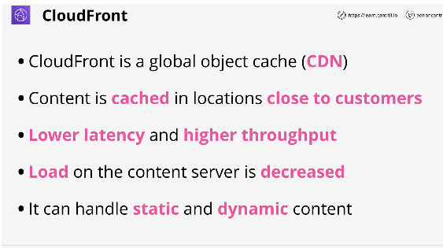
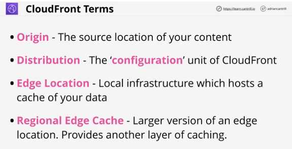
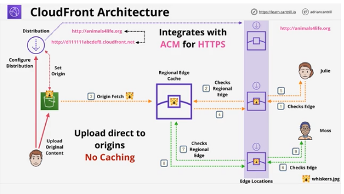
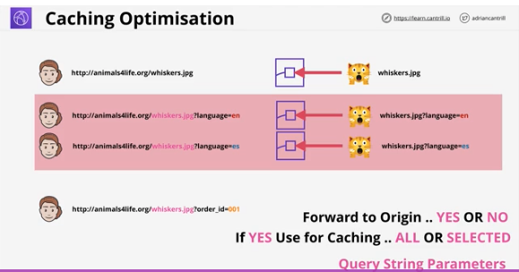
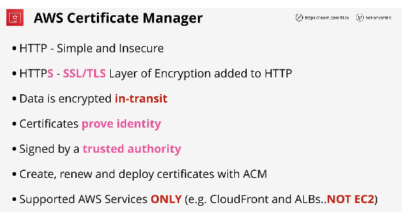
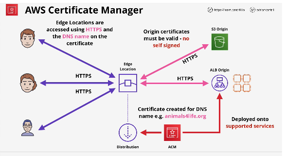

## 1. CloudFront Architecture Basics

#

### summary

- cloudfront is AWS's content delivery network(CDN) product
- lesson introduces key product concepts and terms, visually steps through the architecture and talks in detail about managing caching performance

### concepts

- cloudfront is a global object cache(CDN)
- content is cached in locations close to customers
- lower latency and higher throughput
- can handle static and dynamic content
- 

### terms

- origin - source location of your content
- distribution - the configuration unit of cloudfront
- edge location - local infrastructure whic hosts a cache of your data
- regional edge cache - larger version of edge location. provides another layer of caching
- 

### architecture

- bob uploads data to bucket, sets config in a distribution that points to bucket as origin.
- edge locations cache content, are globally distributed.
- each distribution as a domain name
- you config each distribution and deploy it to the edge locations
- in middle, are the regional edge locations. support multiple edges in same location area
- if data isnt in edge location, it checks the regional edge. see slide
- integrates w/ACM to add HTTPS availability
- caching is only for GETS. PUTS go directly to origin, no right caching. know for exam
- 

### caching optimization

- when caching object, you also cache any query string parameters
- to get cached copy, you need to also cache the query string
- be careful when using query string parameters. i.e. order_id
- option Forward to Origin - YES or NO
- 

## 2. ACM

#

### summary

- AWS certificate manager is a service which allows the creation, management, and renewal of certs
- allows deployment of certs onto supported AWS services such as Cloudfront and ALB

### concepts

- for exam, only need to know the public cert part
- handles encryption and handle identity
- HTTP Simple and Insecure
- HTTPS - SSL/TLS layer of encryption added to HTTP
  - creates a secure tunnel where HTTP travels in
  - secure in transit
- data is encrypted in transit
- certificate prove identity
- signed by a trusted authority
- supported AWS services only eg CloudFront and ALBs NOT EC2
- 

### architecture

- use ACM to create cert
- created a cloudfront distribution using ALB
- customers communicate w/edge location use https and edge communicates w/origins using https(not self signed)
- 

## Demos

#

2 demos:

1. first demo is 2 parts:

- 1. adding a CDN to a static website using S3 and Cloudfront part 1

  - create S3 bucket, add content, make avail globally using CFN

- 2.  Adding a CDN to a static website using S3 and Cloudfront part 2

  - continuation of first video. finishing up setting up distribution

2. second demo:

- adding a custom domain and HTTPS to a cloudfront distribution using ACM

## 3. Securing CF and S3 using OAI

#

### summary

- OAI - origin access identities is a feature where virtual identities can be created, associated with a cloudfront distribution and deployed to edge locations
- access to an S3 bucket can be controlled by using OAIs - allowing access from an OAI, and using an implicity DENY for everything else
- OAIs are generally used to ensure no direct access to S3 objects is allowed when using private CF distributions

### concepts

### architecture

## Demo

#

## 4. Lambda@Edge

#

### summary

### concepts

### architecture

## 5. Global Accelerator

#

### summary

### concepts

### architecture
