## 1. Border Gateway Protocol 101

#

### summary

- high level intro to BGP which is used by some AWS services such as Direct Connect and Dynamic Site to Site VPNs

### concepts

- Autonomous Systems are "black boxes". routers controlled by one entity a network in BGP
- Autonomous Systems Numbers are unique and allocated by IANA and are private. 16bit in length. some are private
- operates over TCP port 179 - it's reliable
- not automatic - peering is manually configured
- path-vector protocol. uses ASPATH
- know terms - iBGP and eBGP see slide
- 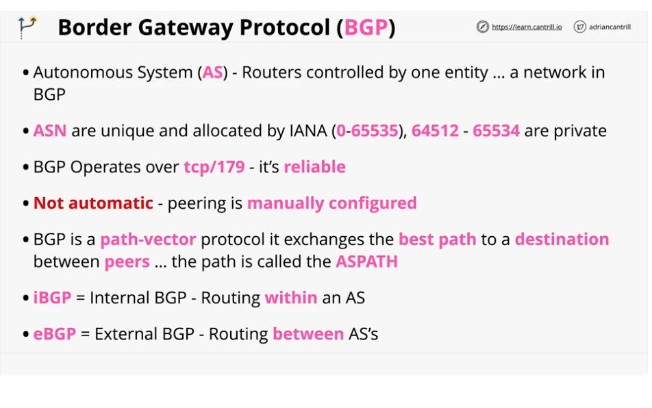

### architecture

- using Australia as a example. see slides and video for detailed explanation
- 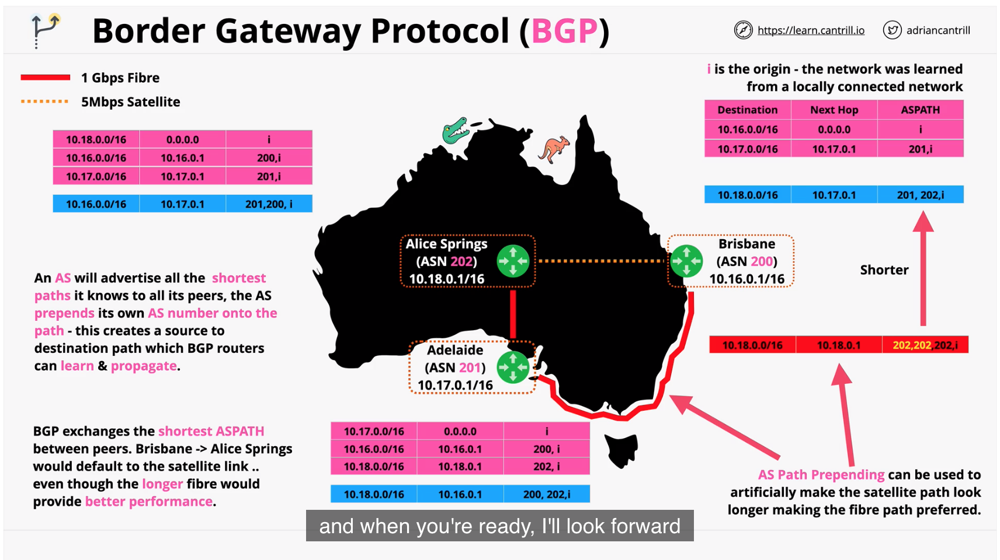

## 2. AWS Site-to-Site VPN

#

### summary

- AWS site to site VPN is a hardware solution which creates a highly scalable IPSEC VPN between an aWS VPN and external netowrk such as on-prem traditional networks
- VPNs are quick to setup vs direct connect, dont offer the same high performance, but do encrypt data in transit.
- this lesson details the concept and arch needed for exam
  [hybrid site to site lesson link](https://learn.cantrill.io/courses/730712/lectures/15532724)

### concepts

- offer quickest way to create a link for AWS env and onprem
- when and where to use for exam
- logical connection between VPC and onprem network
- encrypted using IPSec running over public internet
- can be fully Highly Available if designed/implemented correctly
- quick to provision. can be up/running less than 1 hour
- components:
  - vpc
  - virtual private gateway(VGW)
  - customer gateway(CGW)
  - VPN connection between VGW and CGW
- 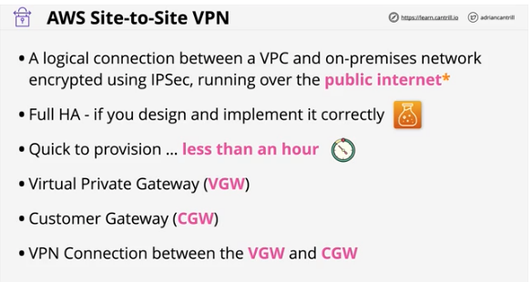

### architecture

- partial high availability, HA on AWS side, not on cust side. see video and slides
- 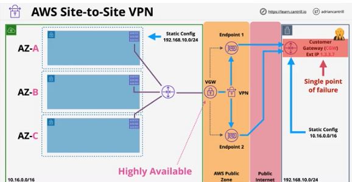
- solution: add another onprem cust router. create another VPN connection that links to VGW. see slide and video
- 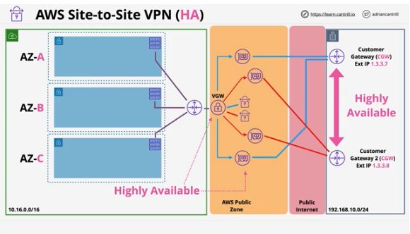

### static vs dynamic VPN (BGP)

#### architecture

- difference is how routes are communicated
- static uses IPsec and must be manually configured
- dynamic uses BGP and lets the routers communicate w/each other
- 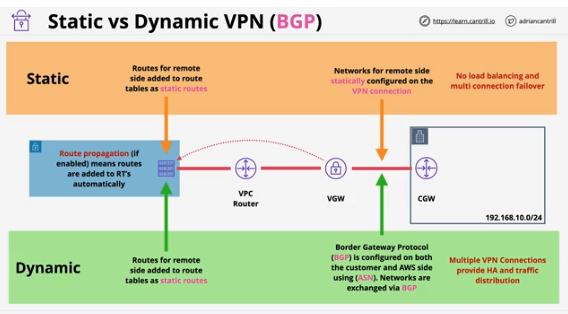

#### considerations

- speed limitations - 1.25Gbps know for exam
- latency considerations - inconsistent, travels over public internet
- cost - AWS hourly cost, GB out cost, data cap(on prem)
- speed of setup - hours or less. all software configurations
- can be used as backup for Direct Connect(DX)
- can be used with Direct Connect(DX)
- 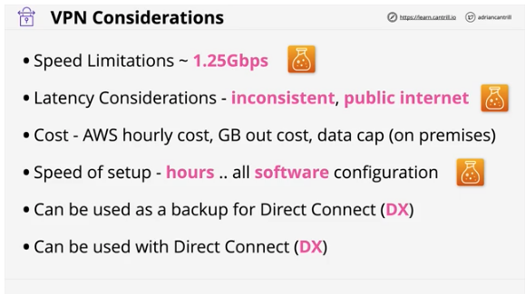

## Demos

#

### summary

#### 2 part demo

1. part 1 - VPC and on-premises VPN part 1

- implement a site-to-site VPN between and onprem location and AWS
- lesson uses a UNIFI CGW - your steps may vary depending on vendor

2. part 2 - VPC and on-premises VPN part 2

- continued

## 3. Direct Connect

#

### summary

- DirectConnect is AWS's physical private link connecting your business premises to it's public & private services
- has pros/cons vs site-to-site VPN and it's impossible to demo w/o using
- lesson teaches theory/arch needed for exam
- [lesson link](https://learn.cantrill.io/courses/730712/lectures/15532730)

### concepts

- like site to site VPN, but actual physical connection to AWS network
- A 1Gbps or 10Gbps network port into AWS
- at a DX location. see slides for physical standard
- cust router is connected at DX location. router must support BGP
- DX basically gives you a part at a DX location. you arrange the connection to that port
- on top of the DX connection, you can run multiple virtual interfaces, known as VIFS
- 2 types - private and public
- encryption not supported by default
- 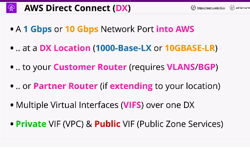

### architecture

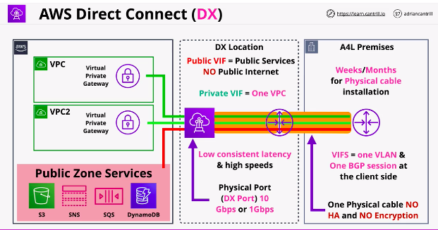

### considerations

- takes much longer to provision vs VPN
- extension to prem can take weeks/months depending on telco company
- DX is faster 40Gbps w/aggregation
- low consistent latency, doesn't use business bandwidth
- NO BUILT IN ENCRYPTION
- 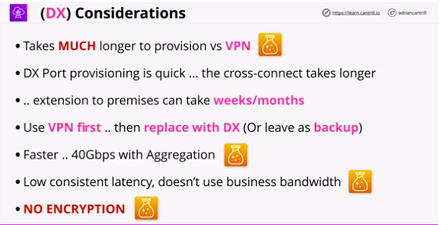

### encryption arch ex

- run an IPsec vpn over the public VIF to encrypt in transit
- 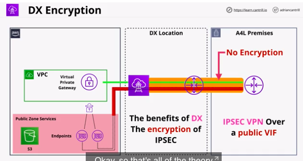

## 4. Direct Connect Resilience

#

### summary

- cover arch of a few resilient applications of DX
- starting w/overview of the default implementation offers no resilience
- [lesson link](https://learn.cantrill.io/courses/730712/lectures/24660629)

### concepts

### architecture

## 5. Transit Gateway

#

### summary

### concepts

### architecture

## Demos

#

### summary

## 6. Storage Gateway

#

### summary

### concepts

### architecture

## 7. Snowball/Edge/Snowmobile

#

### summary

### concepts

### architecture

## 8. Directory Service

#

### summary

### concepts

### architecture

## 9. DataSync

#

### summary

### concepts

### architecture

## 10. FSx for Windows Servers

#

### summary

### concepts

### architecture

## 11. FSx For Lustre

#

### summary

### concepts

### architecture
