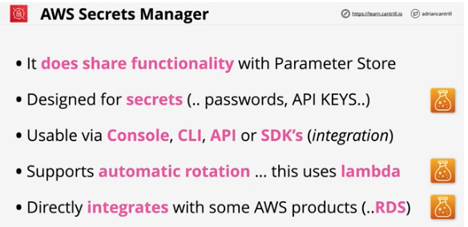
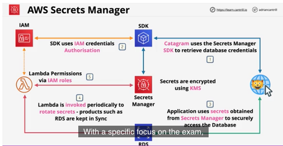
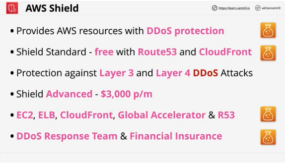
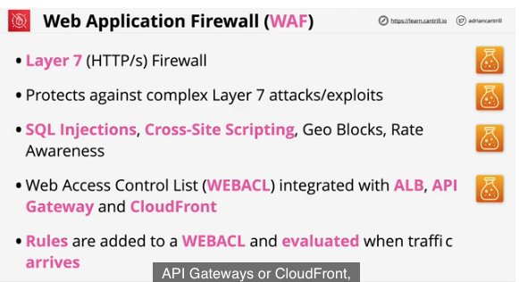
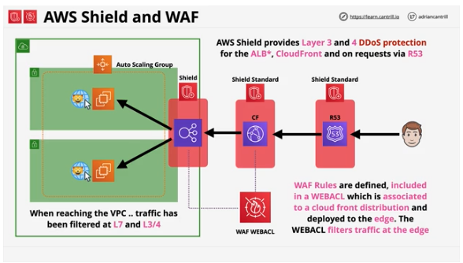

## 1. AWS Secrets Manager

#

### summary

- product that manages secrets within AWS. There is some overlap between it and the SSM parameter store - but secrets manager is specialized for secrets
- Secrets Manager is capable of automatic credential rotation using Lambda
- for supported services, it can even adjust the credentials of the service itself
- [lesson link](https://learn.cantrill.io/courses/730712/lectures/15793908)

### concepts

- often gets confused w/SSM parameter store
- when to use one vs the other. does share some functionality with Parameter Store
- Secrets Manager is designed for secrets....passwords, API Keys
- usable via console, CLI, API, or SDKs(integration)
- supports automatic rotation of secrets using Lambda
- directly integrates with some AWS products(RDS)
- 

### architecture

- ex of a web app using SDK retrieve database creds
- Secrets Manager can periodically use Lambda function to rotate secrets
- secured using KMS
- 

## 2. AWS WAF & Shield

#

### summary

- AWS Shield and Web Application Firewall are both products which provide perimeter defense for AWS networks
- Shield provides DDOS protection and WAF is a Layer 7 Application firewall
- [what is a DDOS attack](https://www.cloudflare.com/en-au/learning/ddos/what-is-a-ddos-attack/)
- [lesson link](https://learn.cantrill.io/courses/730712/lectures/15792890)

### concepts

- more prominent on the exam then before

#### AWS Shield

- provides AWS resources w/DDoS protection
- comes in 2 versions:
  - Shield standard - free w/Route53 and Cloudfront
  - protection against Layer 3 and Layer 4 DDoS attacks
  - Shield Advanced - $3k per month
  - EC2, ELB, Cloudfront, Global Accelerator, Route53
  - 24/7 365 access to DDoS response team and financial insurance
- 

#### AWS WAF - web application firewall

- Layer 7 (HTTP/S) firewall - Application layer
- protects against complex layer 7 attacks
- SQL injections, cross site scripting, Geo Blocks, Rate awareness
- uses web ACL intergrates w/ALB, API Gateway, Cloudfront
- ACL has rules and evaluated when traffic arrives
- 

### architecture

- common to use Shield and WAF together
- 

## 3. CloudHSM

#

### summary

- AWS provided Hardware Security Module products
- CloudHSM is required to achieve compliance with certain security standards such as FIPS 140-3 Level 3
- [more info on FIPS](https://en.wikipedia.org/wiki/FIPS_140-2)
- [lesson link](https://learn.cantrill.io/courses/730712/lectures/15828633)

### concepts

### architecture
