## 1. DynamoDB - Architecture

#

### summary

- DynamoDB is a NoSQL fully managed DBaaS product available within AWS
- [lesson link](https://learn.cantrill.io/courses/730712/lectures/15601347)

### concepts

- NoSQL public DBaaS - Key/Value & DocumentDB model
- no self-managed servers or infrastructure
- manual/automatic provisioned performance in/out or ondemand
- Highly resilient across AZs and optionally globally
- really fast...single digit milliseconds SSD based
- backups, point in time recovery, encrypted at rest
- event driven integration, do things when data changes
- 

### architecture

#### DynamoDB tables

- table is a grouping of items with same primary keys - single or composite
- capacity is speed. 2 values, WCU and RCU. see slide
- 

#### on demand backups

- full copy of table, retained until removed
- can be used to restore data, configuration
- same region or cross region
- restore w/ or w/o indexes and adjust encryption setting
- 

#### point-in-time backups

- disabled by default, enable table by table basis
- continuous record of changes for 35 day window
- 1 second granularity
- 

### key considerations

- NoSQL - preference DynamoDB for the exam
- relational data questions - probably not DynamoDB
- Key/Value - preference is DynamoDB
- access via console, CLI, API....no SQL
- billing - based on table - RCU, WCU, storage and features
- 

## 2. DynamoDB - Operations, Consistency, and Performance - Part 1

#

### summary

- steps through some key elements of Reads and Writes to DDB
- how the Query and Scan operations work
- [lesson link](https://learn.cantrill.io/courses/730712/lectures/15601351)

### concepts

- 2 capacity modes when creating a table - ondemand and provisioned
  - ondemand - unknown, unpredictable, low admin
    - price per million R or W units
  - provisioned - set capacity value RCU and WCu set on a per table basis
    - every operation consumes 1 unit RCU or WCU
    - 1 RCU is 4kb read operation per second
    - 1 WCU is 1kb write operation per second
    - every table has an RCU and WCU burst pool
- 

### operations architecture

#### query

- accepts a single PK value and optionally a SK or range. see slide for ex
- 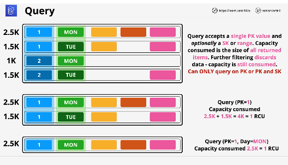

#### scan

- search across an entire table
- more flexible operation, least efficient
- really expensive from a capacity perspective
- 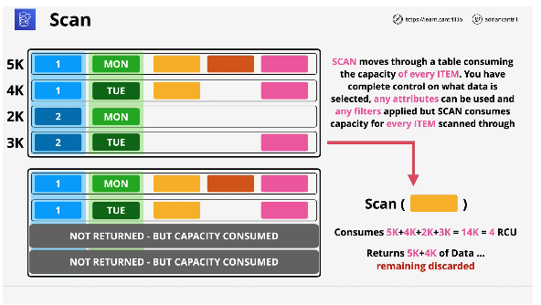

## 3. DynamoDB - Operations, Consistency and Performance - Part 2

#

### summary

- steps through consistency model in DDB
- looks at 2 RCU and WCU calculation examples
- [lesson link](https://learn.cantrill.io/courses/730712/lectures/15603829)

### concepts

- 2 consistency modes: eventual and strong?
- each AZ is a storage node, one node is elected leader
- leader is consistent, it replicates to other nodes every 4 milliseconds
- eventual scales better, but doesnt guarantee most recent data. see ex w/Julie
- 50 percent cheaper
- if you access DDB at the wrong time, you might get outdated data (w/eventual mode)
- strong mode always uses the leader node, so it's always current
- 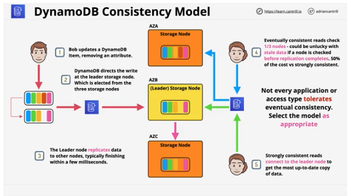

### WCU calculation

- calculate per second
- 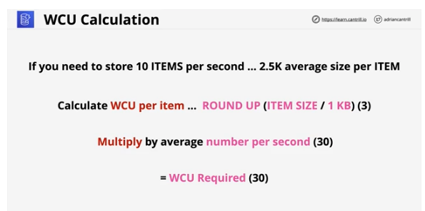

### RCU calculation

- see slide for match
- 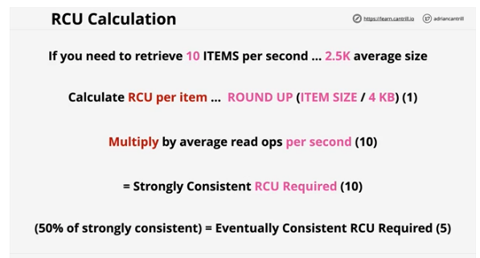

## 4. DynamoDB - Streams & Lambda Triggers

#

### summary

- DDB Streams are a 24hour rolling window of time ordered changes to Items in a DDB table
- streams have to be enabled on a per table basis
- have 4 view types
  - KEYS_ONLY
  - NEW_IMAGE
  - OLD_IMAGE
  - NEW_AND_OLD_IMAGES
- Lambda can be integrated to provide trigger functionality, invoking when new entries are added to the stream
- [lesson link](https://learn.cantrill.io/courses/730712/lectures/15601352)

### concepts

#### streams

- time ordered list of Item Changes in a table
- 24 hour rolling window
- enabled on per table basis
- records INSERTS, UPDATES, DELETES
- different view types influence what is in the stream
  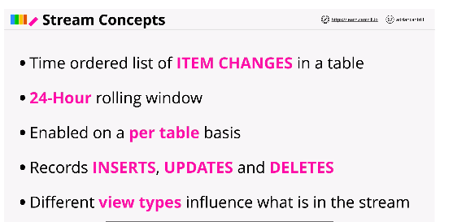

#### streams visually

- 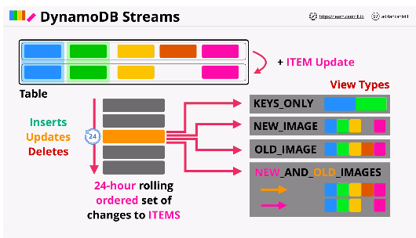

#### Triggers

- action based on change in data, event driven
- ITEM changes generates event
- event contains the data which changed
- an action is taken using that data
- AWS = Streams and Lambda
- reporting and analytics
- data aggregation, messaging, notifications, etc use cases
- 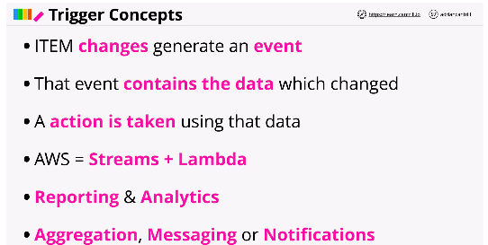

#### Triggers visually

- see slide for ex when Lambda function is triggered
- 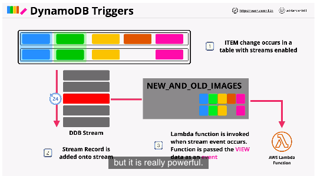

## 5. DynamoDB Local and Global Secondary Indexes

#

### summary

- Local Secondary Indexes (LSI) and Global Secondary Indexes(GSI) allow for an alternative presentation of data stored in a base table
- LSI allows for alternative SK's where GSIs you can use an alternative PK and SK
- [lesson link](https://learn.cantrill.io/courses/730712/lectures/15662767)

### concepts

- query can only work on 1 PK value at a time
- indexes are alternative views on table data
- LSI allow diff SK, GSI allow diff PK and SK
- some or all attributes - projection
- 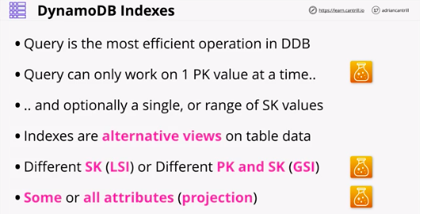

### LSI

- alternative view for table
- must be created with a table
- 5 LSIs per base table
- Alternative SK on the table
- share the RCU and WCU with the table
- attributes - ALL, KEYS_ONLY, INCLUDE
- 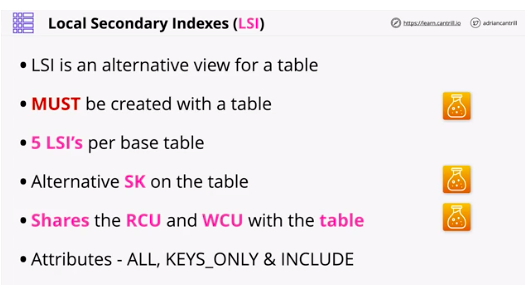

#### LSI visually

- indexes are sparse, see slide and video
- 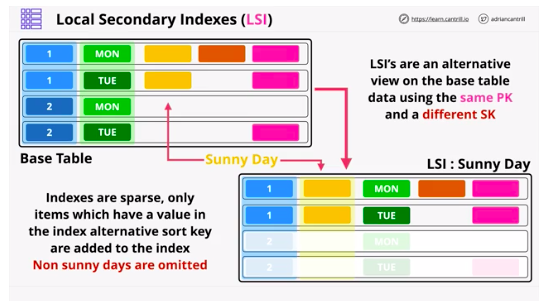

### GSI

- can be created at any time
- default limit of 20 per base table
- alternative PK and SK
- GSIs have their own RCU and WCU allocations
- attributes - ALL, KEYS_ONLY, INCLUDE
- 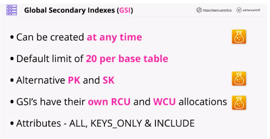

#### GSI visually

- are also sparse, see slide
- 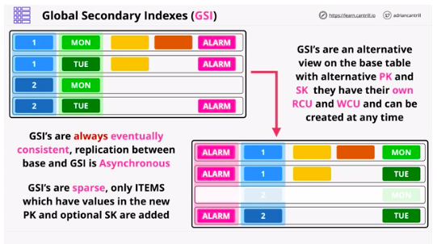

### considerations

- careful w/projections - KEYS_ONLY, INCLUDE, ALL
- queries on attributes not projected are expensive
- use GSIs as default, LSI only when strong consistency is required
- use Indexes for alternative access patterns
- 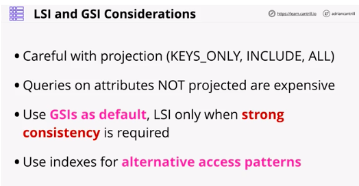

## 6. DynamoDB - Global Tables

#

### summary

- DDG global tables provides multi-master global repliction of DDB tables which can be used for performance, HA or DR/BC reasons
- [lesson link](https://learn.cantrill.io/courses/730712/lectures/15662768)

### concepts

- provide multi master replication
- all tables are the same
- tables are created in multiple region, and added to the same global table - becoming replicas
- Last writer wins is used for conflict resolution
- reads/writes occur to any region
- fast
- strongly consistent reads ONLY in the same region as writes
- 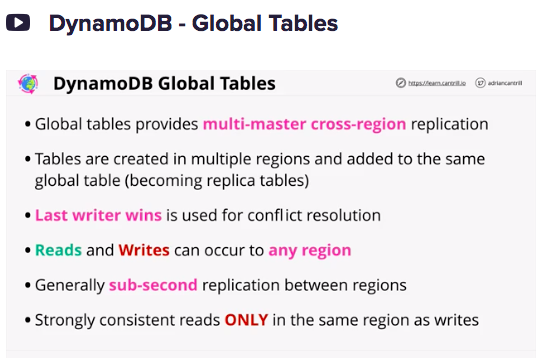

### architecture

- select AWS regions which will be part of global tables
- create DDB tables. select one, add all other tables to global table configuration
- sub-second replication
- globally eventually consistent
- provides global HA, DR, BC
- 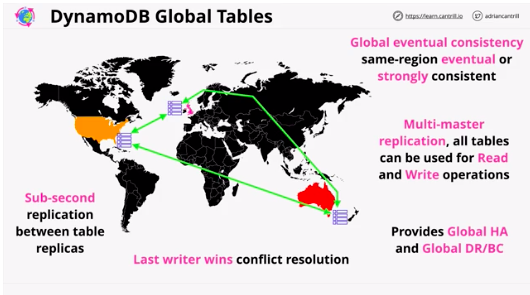

## 7. DynamoDB - Accelerator (DAX)

#

### summary

- DDB Accelerator(DAX) is an in-memory cache designed specifically for DDB
- should be default choice for any DDB caching related questions
- [lesson link](https://learn.cantrill.io/courses/730712/lectures/15662769)

### concepts

- DAX in memory cache for DDB
- improves performance, integrated

#### traditional cache vs DAX

- installs DAX sdk on application
- DAX acts a middleman
- less complex for the app developer
- 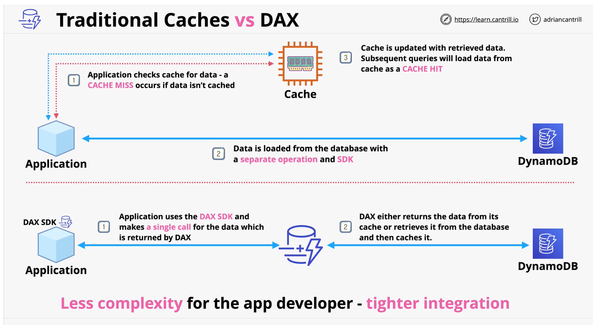

### architecture

- deploy across AZs in a VPC
- uses nodes, primary node replicates to reads in other AZs
- 2 caches - Item Cache and Query Cache
- 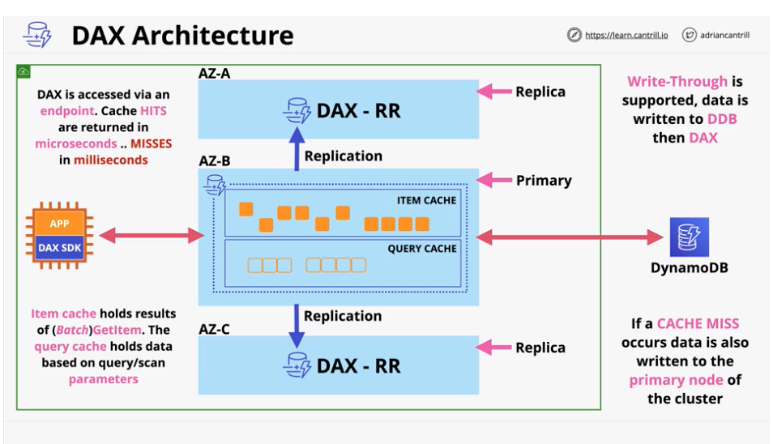

### key considerations

- cluster - primary node(writes) replicas(reads)
- nodes are HA, primary failure, there is election for new primary
- in memory cache - scaling, much faster reads, reduces costs
- scale up or scale out (bigger or more instances)
- supports write-through
- DAX is deployed inside a VPC
- 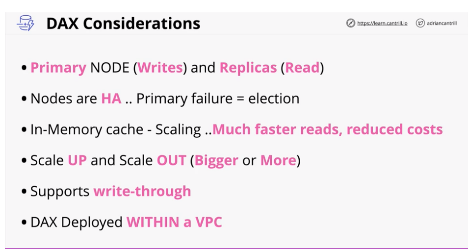

## 8. Amazon Athena

#

### summary

- Athena is a serverless querying service which allows for ad-hoc questions where billing is based on the amt of data consumed
- Athena is an underrated service capable of working w/structured, unstructured, semi-structured data
- [lesson link](https://learn.cantrill.io/courses/730712/lectures/15662776)

### concepts

- serverless interactive querying service
- take data stored in S3 and perform adhoc queries
- pay only data consumed - on demand
- uses process called schema-on-read - table-like translation
- original data is never changed - remains on S3
- Schema translates data -> relationship like when read
- output can be sent to other AWS services, can be event driven
- 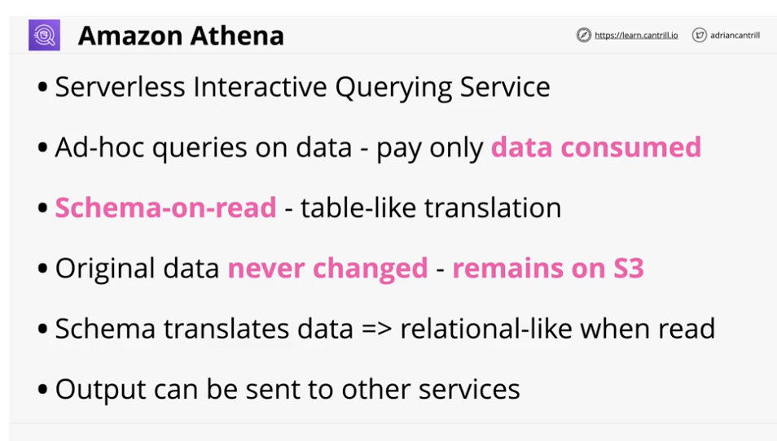

### architecture

- starts w/source data on S3. data is read only, never modified
- supports multiple formats, see slide
- can read data directly from AWS services as well
- inside you create a schema, define tables
- how to get original data to a table
- interact w/data using SQL queries
- 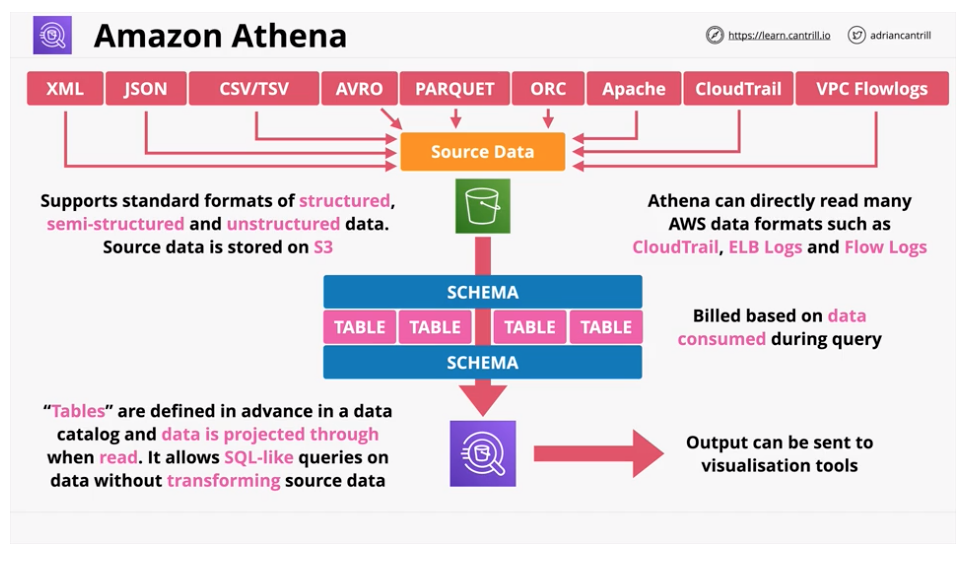

## Demos

#

### 2 part demo

#### Athena Demo part 1

- use Athena to query the open street map database to locate local animal vet facilities for the animal mobile teams
- [lesson link](https://learn.cantrill.io/courses/730712/lectures/17567378)

#### Athena Demo part 2

- use Athena to query the open street map database to locate local animal vet facilities for the animal mobile teams
- [lesson link](https://learn.cantrill.io/courses/730712/lectures/17567380)

## 9. Elasticache

#

### summary

- Elasticache is a managed in memory cache which provides a managed implementation of the redis or memcached engines
- useful for heavy workloads, scaling reads in a cost effective way and allowing for externally hosted user session state
- [aws pricing documentation](https://aws.amazon.com/elasticache/pricing/)
- [lesson link](https://learn.cantrill.io/courses/730712/lectures/22586311)

### concepts

- allows apps to scale to high levels of performance
- in-memory database - high performance
- two diff engines - Redis and memcached as a service
- can be used to cache data, for read heavy workloads, w/low latency requirements
- reduces database workloads - expensive
- cost effective
- can be used to store session data (stateless server)
- requires application code changes
- 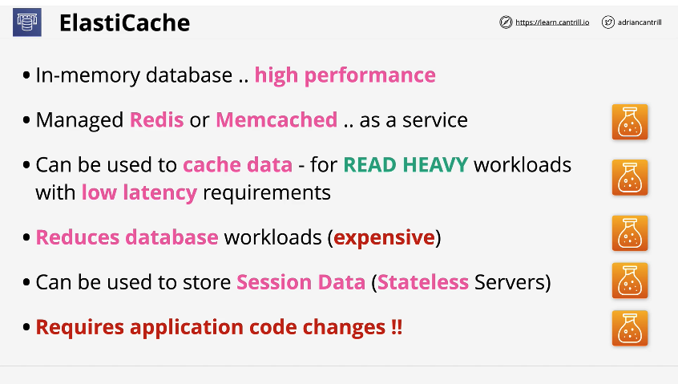

### architecture - caching

- first time users queries application, it checks cache first, it misses, goes to DB for data
- app will write data into cache, future queries come from cache
- allows us to scale and access more customers easier
  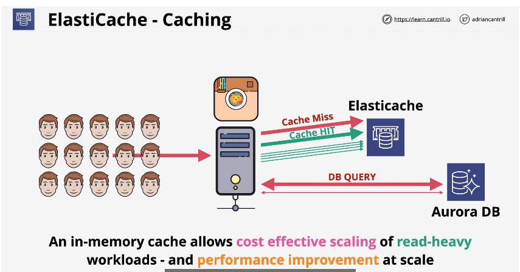

### architecture - session state data

- user session data is written to ElastiCache
- if EC2 instance fails, users connection is moved to another instance by ELB
- ElastiCache loads user's session data to new instance, no disruption to user
- 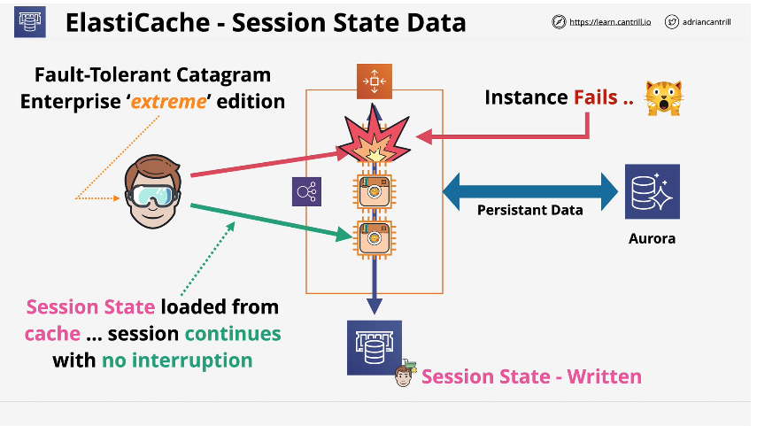

### engines- Redis vs MemcacheD

- both fast and support multiple languages
- diff: data structure support - see slide
- diff: redis supports multi-AZ
- diff: memchacheD - supports multiple nodes(sharding) - redis supports replication
- diff: memcacheD - no backups, Redis - backup and restore
- diff: memcacheD - multithreaded Redis - transactions
- 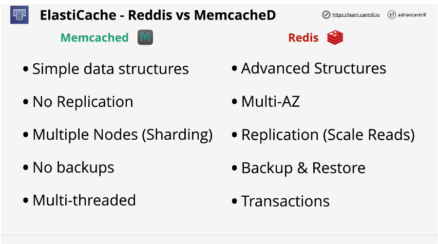

## 10. Redshift Architecture

#

### summary

### concepts

### architecture

## 11. Redshift DR and Resilience

#

### summary

### concepts

### architecture
