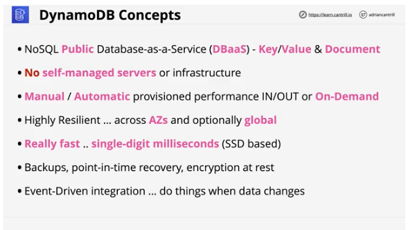
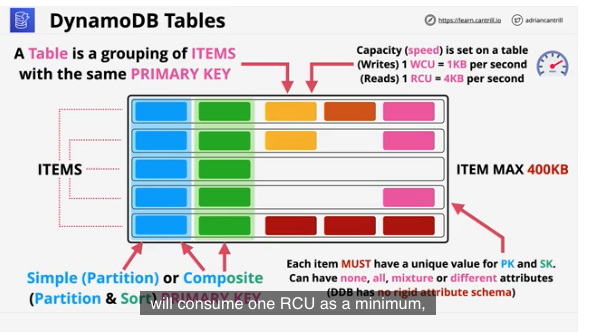
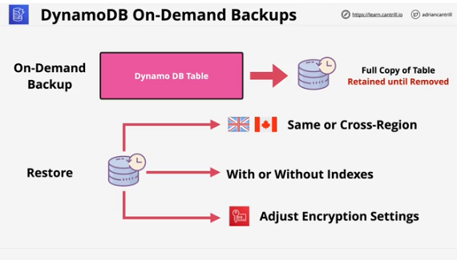
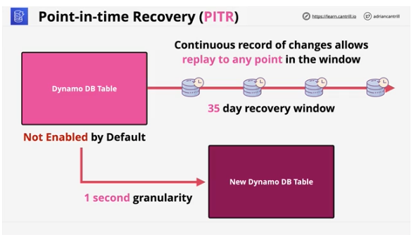
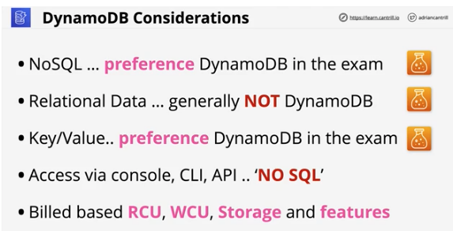

## 1. DynamoDB - Architecture

#

### summary

- DynamoDB is a NoSQL fully managed DBaaS product available within AWS
- [lesson link](https://learn.cantrill.io/courses/730712/lectures/15601347)

### concepts

- NoSQL public DBaaS - Key/Value & DocumentDB model
- no self-managed servers or infrastructure
- manual/automatic provisioned performance in/out or ondemand
- Highly resilient across AZs and optionally globally
- really fast...single digit milliseconds SSD based
- backups, point in time recovery, encrypted at rest
- event driven integration, do things when data changes
- 

### architecture

#### DynamoDB tables

- table is a grouping of items with same primary keys - single or composite
- capacity is speed. 2 values, WCU and RCU. see slide
- 

#### on demand backups

- full copy of table, retained until removed
- can be used to restore data, configuration
- same region or cross region
- restore w/ or w/o indexes and adjust encryption setting
- 

#### point-in-time backups

- disabled by default, enable table by table basis
- continuous record of changes for 35 day window
- 1 second granularity
- 

### key considerations

- NoSQL - preference DynamoDB for the exam
- relational data questions - probably not DynamoDB
- Key/Value - preference is DynamoDB
- access via console, CLI, API....no SQL
- billing - based on table - RCU, WCU, storage and features
- 

## 2. DynamoDB - Operations, Consistency, and Performance - Part 1

#

### summary

### concepts

### architecture

## 3. DynamoDB - Operations, Consistency and Performance - Part 2

#

### summary

### concepts

### architecture

## 4. DynamoDB - Streams & Lambda Triggers

#

### summary

### concepts

### architecture

## 5. DynamoDB Local and Global Secondary Indexes

#

### summary

### concepts

### architecture

## 6. DynamoDB - Global Tables

#

### summary

### concepts

### architecture

## 7. DynamoDB - Accelerator (DAX)

#

### summary

### concepts

### architecture

## 8. Amazon Athena

#

### summary

### concepts

### architecture

## Demos

#

### summary

## 9. Elasticache

#

### summary

### concepts

### architecture

## 10. Redshift Architecture

#

### summary

### concepts

### architecture

## 11. Redshift DR and Resilience

#

### summary

### concepts

### architecture
